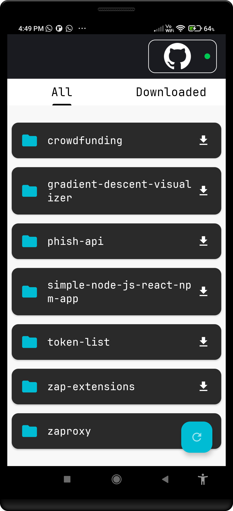

# 🤖 Code Jarvis

**Code Jarvis** is an AI-powered **Git client and offline coding assistant for Android**.  
It brings together version control, syntax-highlighted editing, and offline AI chat — all inside a lightweight mobile app.

Whether you're commuting, reviewing code on the go, or coding from your phone, Code Jarvis keeps you in control.

---

## 📱 Features

✅ **Built-in Git client** – Pull, push, commit, add files  
✅ **AI chat** – Context-free offline chat with a local LLM (GGUF)  
✅ **Flexible model selection** – Choose a GGUF from storage or enter a direct URL  
✅ **Syntax-highlighting editor** – View and edit code with ease  
✅ **File browser** – Navigate and manage local code files  
✅ **Offline-first** – Works without internet once set up

---

## 🚀 Getting Started

1. **Download the APK** from the [Releases](https://github.com/YOUR_USERNAME/code-jarvis/releases) tab  
2. Install it on your Android device  
3. Launch the app and:
   - Choose or paste a GGUF model URL
   - Open your Git project folder
   - Start editing, committing, and chatting!

---

## 🖼️ App Preview

<table>
  <tr>
    <td align="center">
       
      📂 <b>Model Select</b> 
      Select from predefined model or enter a custom one.
    </td>
    <td align="center">
       
      📃 <b>Repos List</b> 
      Connect with GitHub and download repo of choice.
    </td>
    <td align="center">
       
      📃 <b>Downloaded Repos</b> 
      Open the downloaded repo for operations.
    </td>
  </tr>
  <tr>
    <td align="center">
       
      🔧 <b>File Viewer</b> 
      Navigate across all folders and files present.
    </td>
    <td align="center">
       
      ✍️ <b>Code Editor</b> 
      Edit code with syntax highlighting for 10+ languages.
    </td>
    <td align="center">
       
      💬 <b>Chat with AI</b> 
      Talk to a local, context-free LLM about anything.
    </td>
  </tr>
</table>

---

## 📦 APK Download

👉 [Download the latest APK](https://github.com/YashArote/code-jarvis/releases)

---

## 🧠 AI Chat Explained

- Runs a local **GGUF model** (stateless, no context retention)
- No need to connect to any server or cloud
- You can use your own custom models (as long as they're in GGUF format)
- Works offline after model is installed

---

## 🧩 Use Cases

- Manage your Git repositories on mobile  
- Quickly commit and push code from anywhere  
- Use AI for general programming questions offline  
- Learn or prototype on the go  
- Lightweight editing with AI help

---

## 🙌 Contribute

Issues, feedback, and PRs welcome! Help make Code Jarvis even more powerful.

---

## 📄 License

MIT License

---

